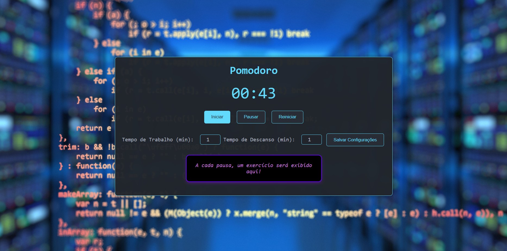
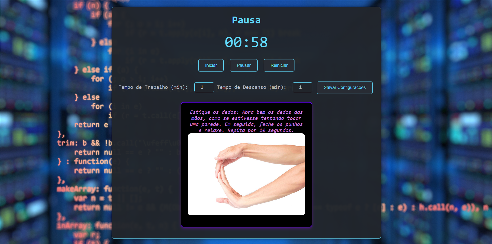

## Pomodoro Timer: Codifique com Saúde e Produtividade!

**Descubra o equilíbrio perfeito entre trabalho e descanso.**

Este projeto oferece um cronômetro Pomodoro personalizado para otimizar suas sessões de trabalho e prevenir Lesões por Esforço Repetitivo (LER). 

**Características:**

* **Intervalos Pomodoro:** Trabalhe em blocos de 25 minutos com pausas curtas para aumentar a concentração.
* **Exercícios para programadores:** Receba recomendações de alongamentos e exercícios para aliviar a tensão muscular e melhorar a postura.
* **Personalização:** Ajuste o tempo de trabalho e descanso de acordo com suas necessidades.
* **Interface intuitiva:** Fácil de usar e navegar.

**Como usar:**

1. Clone este repositório.
2. Abra o arquivo `index.html` em seu navegador.
3. Comece a trabalhar!

**Contribua:**

Quer ajudar a melhorar este projeto? Abra um pull request!

**Tecnologias:**
* HTML
* CSS
* JavaScript

**Imagens:**

